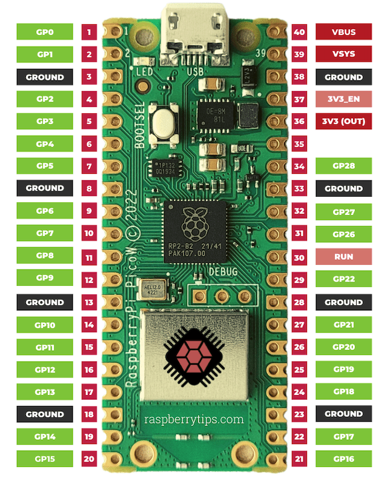

# kepler-cricket-chirper-rs
Cricket chirper example using embedded Rust on a pi pico with parts from the SunFounder Kepler Kit.

<br/>


Photo of Jim's Setup:
<br/>
<br/>


<br/>
<br/>

Pi pico diagram:
<br/>



<br/>
<br/>


# Install target (if needed)
```
rustup target add thumbv6m-none-eabi
```

## How to Build and Flash:
Build the program
```bash
cargo build --release --target thumbv6m-none-eabi
```

Check:
```
file target/thumbv6m-none-eabi/release/pico-buzzer
```

It should be:
```
ELF 32-bit LSB executable, ARM, EABI5 version 1 (SYSV)
```

Then convert to UF2
```bash
elf2uf2-rs target/thumbv6m-none-eabi/release/YOUR_PROJECT_NAME firmware.uf2
```

# Flash to Pico:
# 1. Hold BOOTSEL button
# 2. Plug in USB
# 3. Copy firmware.uf2 to RPI-RP2 drive
# 4. Pico reboots and runs immediately


---

## **How to Run on Battery (Step 3):**

Battery back should be connected (red +) to VSYS (pin 19) and (black -) to GRND (pin 18).
Once you've flashed the code:

**Unplug USB, Connect Battery**
- Unplug USB → switches to battery seamlessly
- Program keeps running!
- To see debug messages: Keep UART cable plugged into computer

---

<br/>

